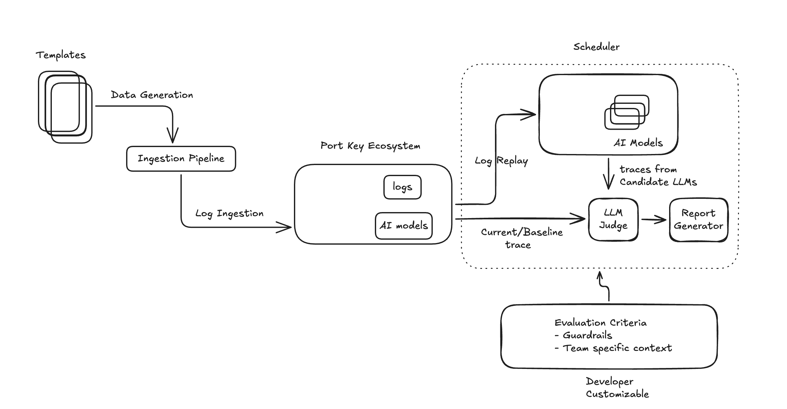

# LLM Evaluation System

An automated framework for testing and comparing AI language models using log replay and AI-powered judging.

## Overview

Templates generate test data that flows through an ingestion pipeline into the Port Key Ecosystem, which stores logs and AI model configurations. The Scheduler orchestrates evaluation by replaying historical logs through candidate LLMs, capturing detailed traces, and using an LLM Judge to compare outputs against baseline performance. Reports are generated based on customizable evaluation criteria including guardrails and team-specific context.

    

## Key Benefits

- **Automated Testing**: Compare multiple models simultaneously using real production logs
- **Cost Optimization**: Identify when cheaper models perform equivalently  
- **Risk Mitigation**: Test thoroughly before production deployment
- **Data-Driven Decisions**: Objective metrics for model selection and regression testing

